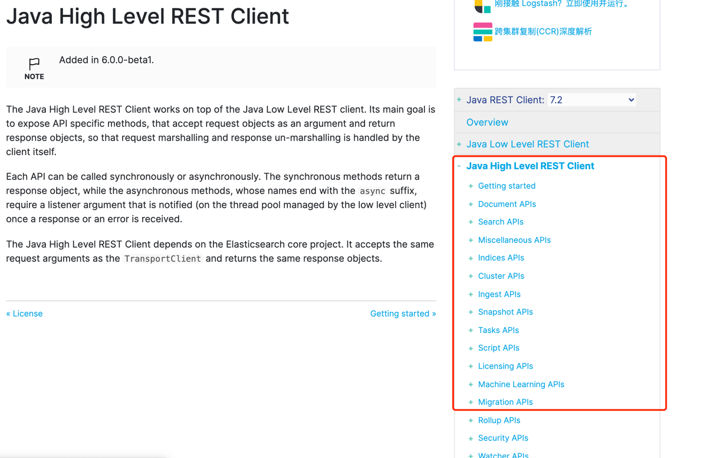

# es-rest-high-demo

>最近开始学习es相关内容，但是es的api实在不敢恭维，网上能找到写的比较好的，比较全的也没有找到。看官网的api奈何自己英文不好，理解不好。所以自己写个项目，翻译一下官网的api吧
 
官方api地址
`https://www.elastic.co/guide/en/elasticsearch/client/java-rest/7.2/java-rest-high.html`

> 本文基于7.2版本